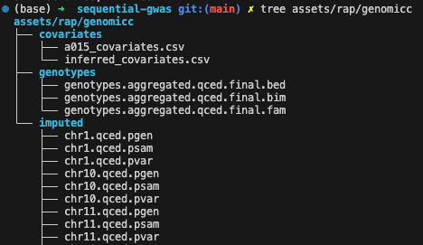

# Merging the GenOMICC and UK Biobank Cohorts

This workflow yields combined:

- genotypes in PLINK bed format: obtained by subsampling the TOPMed UKB imputed genotypes to keep the GenOMICC variants.
- imputed genotypes in PLINK pgen format: ontained by merging UKB and GenOMICC TOPMed UKB imputed genotypes.
- covariates containing the current age and sex of individuals
- ancestry estimates: via the 1000 Genome Project

It is assumed that you have installed the required dependencies as explained in [Working with the UKB RAP](@ref).

## 1. Uploading Inputs

This section describes the main inputs to the workflow that need to be uploaded to the RAP. I recommend deviating as little as possible from the following instructions to make sure things run smoothly afterwards. In this section we will populate the `assets/rap` folder in this repository that we will then upload to the RAP using the upload agent.

In particular we need to populate the `genomicc` and `kgp` subfolders as displayed below. The `hesin_critical_fields.txt` and `main_fields.txt` should already be present.


### GenOMICC Data

We will need the following GenOMICC data, at the present time, the name of the file does not matter since it seems impossible to reference a file by its path on the RAP, instead we will have to use file IDs: 

- genotypes: Output by [Combining Datasets](@ref).
- covariates: 
  - General covariates provided by Dominique, it should contain an `age_years` and a `sex` column.
  - Inferred covariates output by [Combining Datasets](@ref) containing ancestry estimates.
- imputed genotypes: Output by [Genotypes Imputation](@ref).

I recommend to organise them as follows:



!!! note "Imputed Genotypes"
    Keep the imputed genotypes organised in chromosomes. Only 3 chromosomes are presented above for readability but all 22 chromosomes should be in the folder.

### 1000 Genome Project

You will also need the 1000 Genome Project genotypes in plink format, filtered to keep only variants matching the GenOMICC genotyped variants. This is an output of the [Combining Datasets](@ref) workflow. They can be organised as follows:


### Uploading the data

Since this is a lot of data, we need to use the [upload agent](https://documentation.dnanexus.com/downloads#installing-the-upload-agent). Asumming `ua` is in your path, run:

```bash
export PROJECT_ID=PPP
export AUTH_TOKEN=XXX
ua --project $PROJECT_ID --auth-token $AUTH_TOKEN --folder /assets assets/rap/ --recursive
```

## 2. Extracting Phenotypes

At this point, it seems impossible (or very difficult) to extract phenotypes from a WDL workflow because the source dataset is not a regular file (see [this](https://community.ukbiobank.ac.uk/hc/en-gb/community/posts/16019555833117-How-do-I-call-the-table-exporter-applet-from-my-WDL) or [that](https://community.ukbiobank.ac.uk/hc/en-gb/community/posts/16019577183901-I-would-like-to-access-phenotype-data-from-within-a-WDL-task-using-a-python-script-How-do-I-localize-the-database-file-as-an-input-to-the-task-I-m-getting-a-wrong-type-error)). We thus have to first run a native DNA Nexus workflow to extract some preliminary data from the source dataset. First we build the workflow:

```bash
dx build export_covariates
```

Then run it (replace the `DATASET_RECORD_ID` with the one corresponding to your project):

```bash
DATASET_RECORD_ID=record-J0pqJxjJZF8G55f99FF11JJ9
dx run -y /export_covariates \
--destination /export_covariates_outputs/ \
-istage-J0vx360JpYQ0Jg1QJ5Zv0PFx.dataset_or_cohort_or_dashboard=$DATASET_RECORD_ID \
-istage-J0vx360JpYQ0Jg1QJ5Zv0PFx.field_names_file_txt=/assets/hesin_critical_fields.txt \
-istage-J0ygjB0JpYQJg4b985gqYkx6.dataset_or_cohort_or_dashboard=$DATASET_RECORD_ID \
-istage-J0ygjB0JpYQJg4b985gqYkx6.field_names_file_txt=/assets/main_fields.txt
```

You can monitor the workflow on the RAP, once finished you should have two outputs in the `/export_covariates_outputs` folder: `` and ``.

## 3. Merging Cohorts

First you need to compile the WDL workflow and upload it to the RAP, this can be done by the following:

```bash
export DX_COMPILER_PATH=/Users/olabayle/dxCompiler/dxCompiler-2.13.0.jar
export PROJECT_ID=project-J0pkqyQJpYQ133JG1p2J1qzv
java -jar $DX_COMPILER_PATH compile wdl/ukb_merge/workflow.wdl -f -project $PROJECT_ID -folder /workflows -inputs wdl/ukb_merge/inputs.json
```

where the `DX_COMPILER_PATH` and `PROJECT_ID` have to be set appropriately. The compiler might output some warnings like `missing input for non-optional parameter` but you can ignore these.

Then, you can run the workflow with the following command

```bash
dx run /workflows/merge_ukb_and_genomicc -f wdl/ukb_merge/inputs.dx.json --destination /ukb_merge_outputs/
```

## Outputs
